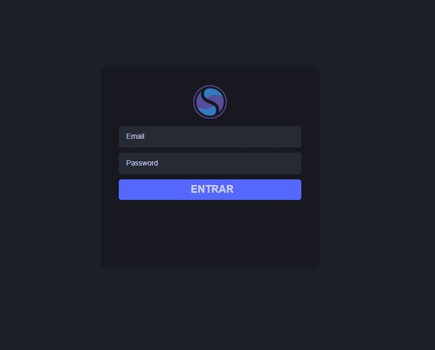

<h1 align="center">Login com Laravel e Firebase</h1> 

## Descrição do Projeto

Este projeto é um projeto base onde demonstra uma estrutura de autenticação com Laravel e Firebase

<h4 align="center"> 
	🚧  PHP, LARAVEL, FIREBASE 🚀 Em construção...  🚧
</h4>

Esse projeto faz parte de uma série de projeto que utiliza várias linguagens de programação, afim de deixar a disposição uma página com login e autenticação pronta

## Estrutura de Iniciação

 Primeiro iniciaremos o projeto utilizando a documentação do Laravel. Iremos também utilizar a seguinte instrução para criarmos o projeto.

 composer create-project laravel/laravel loginauthproject, após isso iremos entrar na pasta do projeto e iniciar o artisan serve

<h4 align="center"> LOGIN </h4>

